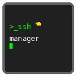

# SSH Manager

A cross-platform GUI application for managing SSH configurations through organized folders and visual forms, distributed via npm with desktop shortcuts.

<div align="center">
  
</div>

## Overview

SSH Manager simplifies the management of multiple SSH connections by providing:

- 🖥️ **Visual Configuration**: Easy-to-use forms instead of editing config files
- 📁 **Organized Storage**: Group connections by work/personal/projects  
- 🚀 **One-Click Connections**: Desktop shortcuts for quick SSH access
- 📋 **Template System**: Pre-built configurations for common setups
- 🌍 **Cross-Platform**: Works on macOS, Windows, and Linux
- 🔐 **SSH Key Management**: Generate and manage SSH keys with proper permissions
- 🔧 **Developer Features**: Port forwarding, multiplexing, X11 forwarding
- 🔒 **Secure**: No logging of sensitive data, proper validation

## Target Users

- Network engineers managing multiple servers
- Developers needing X11 forwarding and port tunneling
- System administrators with complex SSH setups
- Users requiring SOCKS proxy and connection multiplexing
- Anyone who frequently connects to remote systems

## Installation

```bash
npm install -g ssh-manager
ssh-manager create-shortcut  # Creates desktop shortcut
```

## Screenshots

### Main Application Window

*The main SSH Manager interface showing organized connection groups and the connection sidebar*

### Add Connection Dialog

*Easy-to-use form for adding new SSH connections with template selection*

### Edit Connection Window

*Comprehensive editing interface with advanced SSH options and developer features*

### Connection Management

*Detailed view of SSH connection settings with quick actions and testing capabilities*

> **Note**: Screenshots will be added in the next release. The application provides a clean, intuitive interface for managing SSH connections with organized folder structures and advanced configuration options.

## Quick Start

1. Install the package globally via npm
2. Run `ssh-manager create-shortcut` to add desktop icon
3. Click the desktop shortcut to open the GUI
4. Add your first SSH connection using the visual form
5. Organize connections into folders (work/personal/projects)

## Features

- **GUI Interface**: Electron-based desktop application
- **Visual Forms**: Add/edit SSH connections without touching config files
- **Connection Management**: One-click SSH launching with advanced settings
- **Developer Features**: Connection multiplexing, X11/agent forwarding, port forwarding
- **SOCKS Proxy**: Dynamic port forwarding for secure tunneling
- **Templates**: Pre-built configurations (Basic Server, Developer Workstation, AWS EC2, Jump Host)
- **SSH Key Management**: Generate, import, and assign SSH keys
- **Export Configurations**: Export SSH configurations as text files for backup purposes
- **Connection Testing**: Verify SSH connectivity
- **Cross-Platform Distribution**: macOS, Windows, and Linux packages

## Architecture

```
┌─────────────────────────────────────────┐
│             Desktop Shortcut            │
│          (OS-specific icon)             │
└─────────────┬───────────────────────────┘
              │
┌─────────────▼───────────────────────────┐
│         Electron Main Process          │
│        (Node.js Backend Logic)          │
└─────────────┬───────────────────────────┘
              │
┌─────────────▼───────────────────────────┐
│        Electron Renderer Process       │
│         (HTML/CSS/JS Frontend)          │
└─────────────────────────────────────────┘
```

## File Organization

SSH Manager creates an organized structure in your home directory:

```
~/ssh_manager/
├── config/
│   ├── work/           # Work-related SSH connections
│   ├── personal/       # Personal servers
│   └── projects/       # Project-specific connections
├── keys/               # SSH key files organized by category
└── templates/          # Configuration templates
```

Your main SSH config (`~/.ssh/config`) will include these organized files automatically.

## Development

### Project Structure
```
ssh_manager/
├── src/
│   ├── main.js              # Electron main process
│   ├── backend/             # Core SSH management logic
│   │   ├── ssh-manager.js   # Main SSH management class
│   │   ├── file-utils.js    # File system utilities
│   │   └── templates.js     # Template management
│   └── frontend/            # GUI interface
│       ├── index.html       # Main application window
│       ├── app.js           # Frontend application logic
│       ├── preload.js       # Electron preload script
│       └── styles.css       # Application styles
├── assets/
│   └── icons/               # Application icons (all platforms)
├── templates/               # SSH config templates
├── bin/
│   └── ssh-manager.js       # CLI entry point
└── scripts/                 # Installation scripts
    ├── postinstall.js       # Post-installation setup
    └── preuninstall.js      # Pre-uninstall cleanup
```

### Development Setup
```bash
git clone https://github.com/isriam/ssh_manager.git
cd ssh_manager
npm install
npm run dev
```

### Available Scripts
```bash
npm start          # Launch the application
npm run dev        # Development mode with DevTools
npm run build      # Build distribution packages
npm run test       # Run test suite
npm run lint       # Code linting
```

## Contributing

This project is designed for network engineers and developers who need better SSH connection management. Contributions welcome!

## License

MIT License - see LICENSE file for details.

## Security

SSH Manager is a defensive security tool focused on:
- Secure storage of SSH configurations
- No logging of sensitive data
- Proper file permission handling
- Input validation and sanitization

---

**Version**: 0.1.3  
**Repository**: https://github.com/isriam/ssh_manager  
**npm Package**: `ssh-manager`
